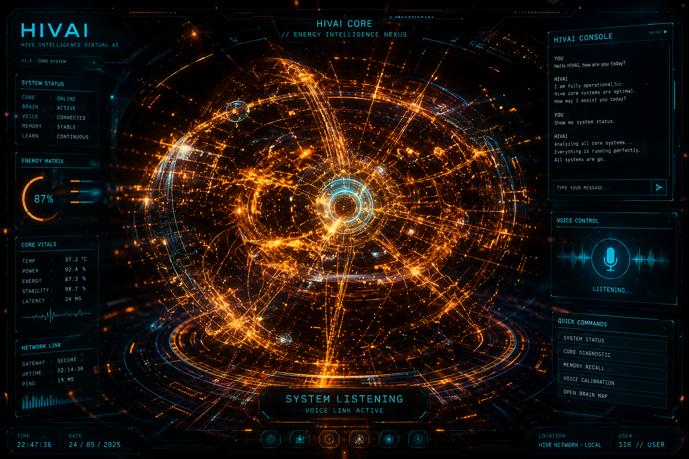

# HiVAI — v1.2 Brain Gateway

HiVAI v1.2 adds the first real backend boundary between the futuristic web HUD and an AI provider.

## Architecture

Browser HUD -> FastAPI gateway -> AI provider

The API key stays on the backend. It is never placed in `index.html`.

## Preview



## Run locally

1. Create a virtual environment.
2. Install `requirements.txt`.
3. Copy `.env.example` to `.env`.
4. Set `AI_API_URL`, `AI_API_KEY`, and `AI_MODEL`.
5. Start the API:

```bash
uvicorn backend.main:app --reload --port 8000
```

Health check:

```text
http://127.0.0.1:8000/api/health
```

The configured provider endpoint should accept an OpenAI-compatible Chat Completions payload.

## Security note

Do not put a real API key in GitHub Pages, JavaScript, HTML, README files, screenshots, or client-side environment variables. Store secrets in the backend hosting platform's secret/environment-var[...]
